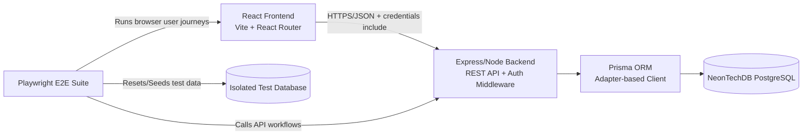

# Final Project Repository

Arrowhead is a monorepo for a gym management system with a React frontend, an Express/Prisma backend, and Playwright end-to-end tests.

## Quick Start

1. Install dependencies from the repository root.

```bash
npm install
```

2. Create local environment files from the examples.

```bash
cp backend/.env.example backend/.env
cp frontend/.env.example frontend/.env
cp e2e/.env.example e2e/.env.test
```

3. Fill in the database URLs and seed passwords in `backend/.env` and `e2e/.env.test`.

4. Start both apps in development mode.

```bash
npm run dev
```

5. Open the frontend at `http://localhost:5173` and the backend at `http://localhost:5001`.

## New Developer Day 1 Verification Checklist

Use this checklist on a clean machine to confirm the system is fully operational.

### 1. Prerequisites installed

- [ ] Node.js 20+ is installed.
- [ ] npm is available.
- [ ] You have a PostgreSQL/Neon database URL for development.

### 2. Install and environment setup

- [ ] Run workspace install from repository root:

```bash
npm install
```

- [ ] Create environment files:

```bash
cp backend/.env.example backend/.env
cp frontend/.env.example frontend/.env
cp e2e/.env.example e2e/.env.test
```

- [ ] Configure values in `backend/.env`:
  - [ ] `DATABASE_URL`
  - [ ] `DIRECT_URL`
  - [ ] `FRONTEND_URL`
  - [ ] `JWT_SECRET`
  - [ ] `SEED_OWNER_PASSWORD`
  - [ ] `SEED_STAFF_PASSWORD`

- [ ] Confirm `frontend/.env` has `VITE_API_BASE_URL=http://localhost:5001` (or your backend URL).
- [ ] Confirm `e2e/.env.test` has `DATABASE_URL_TEST` pointing to an isolated test database.

### 3. Backend data and build preparation

- [ ] Generate Prisma client:

```bash
npm --prefix backend run db:generate
```

- [ ] Seed the development database:

```bash
npm --prefix backend run db:seed
```

### 4. Run the application

- [ ] Start backend and frontend together:

```bash
npm run dev
```

- [ ] Verify frontend loads at `http://localhost:5173`.
- [ ] Verify API health endpoint returns `status: UP`:

```bash
curl http://localhost:5001/api/health
```

### 5. Basic functional smoke checks

- [ ] Log in with seeded `owner` or `staff` credentials.
- [ ] Open the Members page and confirm list data renders.
- [ ] Open the Payments page and confirm membership plans are available.
- [ ] (Optional) Run one E2E spec:

```bash
npm --prefix e2e run test:e2e -- test/specs/payment-subscription.e2e.spec.ts
```

## Documentation

- Backend package guide: [backend/README.md](backend/README.md)
- Architecture diagram and module overview: [docs/architecture.md](docs/architecture.md)
- Frontend package guide: [frontend/README.md](frontend/README.md)
- E2E package guide: [e2e/README.md](e2e/README.md)

## Repository Layout

```text
final-project-2ndyr/
  backend/        Express API, Prisma schema, seed, and tests
  frontend/       React app, UI components, and client services
  e2e/            Playwright browser tests and database reset helpers
```

## System Overview

- The frontend runs on Vite and talks to the backend over HTTP with `credentials: include` so browser cookies carry the session.
- The backend exposes JSON REST endpoints, enforces authentication/roles in middleware, and persists data through Prisma.
- The E2E suite starts or attaches to the app, resets the test database, and runs browser workflows against seeded data.

## High-Level Architecture



## Module Responsibilities

| Module/Directory | Responsibility |
| --- | --- |
| `backend/src/app.ts` | Composes the Express app: middleware order, CORS policy, cookie parsing, JSON parsing, and route mounting. |
| `backend/src/server.ts` | Bootstraps HTTP server process, selects runtime port, and starts listening. |
| `backend/src/controllers` | Implements request-level business logic and response shaping for each API domain. |
| `backend/src/routes` | Declares endpoint paths, HTTP methods, and middleware/controller wiring. |
| `backend/src/middleware` | Cross-cutting request guards such as authentication and role-based authorization. |
| `backend/src/utils` | Shared backend utilities (session token handling, cookie options, password hashing/verification). |
| `backend/src/lib` | Infrastructure clients and singletons, especially Prisma client lifecycle management. |
| `backend/src/config` | Environment parsing/normalization and runtime-safe configuration helpers. |
| `backend/src/types` | Backend TypeScript type contracts and Express request augmentations. |
| `backend/src/services` | Reserved service-layer folder for extracted domain services; currently empty because logic is controller-centric today. |
| `backend/prisma` | Data model schema, migration history, and seed scripts for local and test data setup. |
| `backend/tests` | Unit and integration test suites plus database preparation/reset helpers. |
| `frontend/src/App.tsx` | Top-level route map and auth gate orchestration for dashboard navigation. |
| `frontend/src/pages` | Route-level page containers that coordinate data loading and compose domain components. |
| `frontend/src/components/layout` | Shared application chrome (sidebar/header/main shell) and dashboard scaffolding. |
| `frontend/src/components/common` | Reusable UI primitives used across multiple pages/domains (search, filters, modal actions, timeout wrappers). |
| `frontend/src/components` | Domain-specific UI components for members, payments, suppliers, reports, equipment, and plans. |
| `frontend/src/services` | API service layer for backend calls, request helpers, and auth-related HTTP utilities. |
| `frontend/src/types` | Frontend domain interfaces and type aliases shared by pages, components, and services. |
| `frontend/src/hooks` | Reserved location for reusable custom React hooks; currently empty. |
| `frontend/src/layouts` | Reserved compatibility folder for layout abstractions; active layout components currently live in `frontend/src/components/layout`. |
| `frontend/src/stories` | Storybook stories and UI fixtures for isolated component/page rendering. |
| `e2e/test/specs` | End-to-end test scenarios that validate critical user journeys in a real browser. |
| `e2e/test/support` | E2E helper utilities: auth helpers, fixtures, and database reset/test orchestration. |

## Core Modules

### Backend

- `src/app.ts`: Express app wiring, CORS, cookies, JSON parsing, and route registration.
- `src/server.ts`: Server bootstrap and port selection.
- `src/controllers/`: Request handlers for auth, members, payments, suppliers, equipment, plans, profiles, and reports.
- `src/routes/`: API route maps and role guards.
- `src/middleware/auth.middleware.ts`: Session verification and role enforcement.
- `src/lib/prisma.ts`: Singleton Prisma client configured for the adapter-based PostgreSQL setup.
- `src/utils/auth.ts`: JWT signing, cookie settings, password hashing, and session verification.

### Frontend

- `src/App.tsx`: Browser routes and protected route shell.
- `src/components/layout/`: App chrome, sidebar, header, and inactivity timeout wrapper.
- `src/pages/`: Page-level screens for login, dashboard sections, and member profile flows.
- `src/components/`: Reusable UI for members, payments, plans, reports, suppliers, and equipment.
- `src/services/`: API clients and HTTP helpers.
- `src/types/`: Shared TypeScript contracts used by components and services.

### E2E

- `test/specs/`: Playwright user journeys for members, payments, inventory, reports, suppliers, and profile management.
- `test/support/`: Login helpers, database reset utilities, and shared fixtures.

## Main API Surface

### Auth

- `POST /api/auth/login`: Validates username, password, and role, then issues the session cookie.
- `POST /api/auth/refresh`: Reissues the active session cookie for authenticated users.
- `POST /api/auth/logout`: Clears the session cookie.
- `GET /api/auth/me`: Returns the authenticated user profile.

### Members and Attendance

- `GET /api/members`: Lists members with search, filter, and pagination.
- `POST /api/members`: Creates a member.
- `PATCH /api/members/:memberId`: Updates a member.
- `PATCH /api/members/:memberId/deactivate`: Deactivates a member.
- `GET /api/members/:memberId/attendance`: Returns attendance history.
- `POST /api/members/:memberId/check-in`: Records a check-in.

### Payments

- `GET /api/plans`: Returns active membership plans for payment selection.
- `POST /api/payments`: Creates a payment and renews the member expiry date.
- `GET /api/members/:memberId/payments`: Returns the payment history for one member.

### Reports

- `GET /api/reports/upcoming-expirations`: Returns active members expiring soon.
- `GET /api/reports/daily-revenue`: Admin-only daily revenue summary.
- `GET /api/reports/monthly-revenue`: Admin-only monthly revenue series.
- `GET /api/reports/low-inventory`: Admin-only low-stock equipment alerts.
- `GET /api/reports/overview`: Admin-only combined reports dashboard data.

## Run Commands

### Root workspace

- `npm run dev`: Run backend and frontend in parallel.
- `npm run build`: Build backend and frontend.
- `npm run start`: Start the compiled backend.
- `npm run test:e2e`: Run Playwright tests.
- `npm run test:e2e:headless`: Run Playwright headless.
- `npm run test:e2e:headed`: Run Playwright with a visible browser.
- `npm run test:e2e:ci`: Run the CI-friendly E2E command.

### Backend package

- `npm --prefix backend run dev`: Start the API in watch mode.
- `npm --prefix backend run build`: Generate Prisma Client and compile TypeScript.
- `npm --prefix backend run test`: Run Jest tests.
- `npm --prefix backend run db:seed`: Seed the local database.

### Frontend package

- `npm --prefix frontend run dev`: Start the Vite dev server.
- `npm --prefix frontend run build`: Type-check and build the production bundle.
- `npm --prefix frontend run storybook`: Run Storybook locally.

## Suggested Onboarding Task

Start with one of these small tasks to understand the system quickly:

- Run `npm --prefix e2e run test:e2e -- test/specs/payment-subscription.e2e.spec.ts` and trace the payment flow from UI to backend.
- Update a label or status badge in the payments or member profile UI and confirm it in Storybook or e2e.
- Inspect the auth flow end-to-end by following `src/App.tsx`, `src/components/common/InactivityTimeout.tsx`, and `src/services/authApi.ts`.

## Troubleshooting

- If the backend cannot connect to the database, verify `backend/.env` and the `DATABASE_URL` / `DIRECT_URL` values.
- If the frontend cannot reach the API, confirm `frontend/.env` contains the correct `VITE_API_BASE_URL`.
- If E2E resets fail, use a dedicated test database in `e2e/.env.test` and run the root `test:e2e` scripts.
