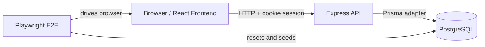

# Architecture

## High-Level Diagram

## Module Overview

### Backend

- `src/app.ts`: Composes middleware, CORS, cookie parsing, JSON parsing, and route registration.
- `src/server.ts`: Starts the HTTP server.
- `src/controllers/`: Implements request handlers and response shaping.
- `src/routes/`: Defines endpoint paths and role guards.
- `src/middleware/auth.middleware.ts`: Restores the authenticated user from the session cookie or bearer token.
- `src/utils/auth.ts`: Signs and verifies session JWTs, sets cookie options, and handles password hashing.
- `src/lib/prisma.ts`: Prisma client singleton for the PostgreSQL adapter setup.

### Frontend

- `src/App.tsx`: Declares top-level routes and protected dashboard shells.
- `src/components/layout/`: Provides the persistent app shell, sidebar, header, and inactivity timeout.
- `src/pages/`: Page-level screens for login, members, payments, equipment, suppliers, reports, plans, and profiles.
- `src/components/payments/`: Member lookup, plan selection, payment method selection, and submit actions.
- `src/components/reports/`: Report cards and alert lists.
- `src/services/`: API clients that keep HTTP concerns isolated from UI components.
- `src/types/`: Shared DTO and UI types used across the frontend.

### E2E

- `test/specs/`: User-journey tests for the main workflows.
- `test/support/`: Login helpers and database reset logic.

## API and Interface Notes

### Auth contract

- Login uses `POST /api/auth/login` and returns a cookie-backed session.
- Refresh uses `POST /api/auth/refresh` and extends the active session only when the user is still authenticated.
- Logout uses `POST /api/auth/logout` and clears the cookie.
- The frontend stores `authRole` and `authUsername` in sessionStorage only for navigation/UI state; the session itself is server-backed.

### Payment flow contract

- `GET /api/members` returns member status so the payment page can show whether the selected member is active, expired, or inactive.
- `GET /api/plans` returns active membership plans for quick selection.
- `POST /api/payments` creates the payment and updates the member expiry date in one transaction.
- `GET /api/members/:memberId/payments` returns the payment history used by the member profile page.

### Reporting contract

- Admin-only report endpoints return daily revenue, monthly revenue, inventory alerts, and membership expiration alerts.
- The reports page consumes the combined overview response from `GET /api/reports/overview`.

## Onboarding Checklist

1. Read [README.md](../README.md) for setup and run commands.
2. Inspect `backend/src/app.ts` to see the API composition.
3. Inspect `frontend/src/App.tsx` and `frontend/src/components/layout/MainLayout.tsx` to understand routing and shell behavior.
4. Run the payment e2e spec to observe the member search, plan selection, and submission flow.
5. Make a tiny UI change in a single component and verify it with a build plus one e2e test.