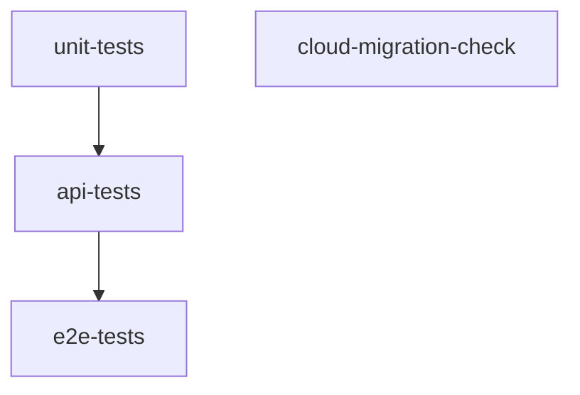

# Testing Strategy — Arrowhead Gym Management System

## 1. Overview

The Arrowhead Gym Management System employs a three-tier testing strategy:

| Tier | Tool | Scope | Location |
|---|---|---|---|
| **Unit** | Jest + ts-jest | Controller logic, utilities, design patterns (database mocked) | `backend/tests/unit/` |
| **Integration** | Jest + Prisma | API routes against a real PostgreSQL database | `backend/tests/integration/` |
| **End-to-End (E2E)** | Playwright | Full browser user journeys against the running application | `e2e/test/specs/` |

Each tier is independently runnable and independently executed in CI.

---

## 2. Unit Tests (Jest)

### 2.1 Scope

Unit tests validate individual controller functions, utility modules, and GoF design pattern implementations in complete isolation. All Prisma database calls are replaced with manual mocks or `jest.mock()`.

**What is tested:**
- Controller request/response logic (happy path + error paths)
- `ConfigManager` singleton initialization and validation
- JWT signing and verification utilities (`src/utils/auth.ts`)
- Design pattern implementations (`src/patterns/`): Singleton, Factory Method, Strategy, Observer, Command

**What is not tested:**
- Database queries (mocked)
- HTTP routing (tested at integration level)

### 2.2 Running Unit Tests

```bash
# From repository root
npm --prefix backend run test:unit

# Watch mode (local development)
npm --prefix backend run test -- --watch
```

### 2.3 File Conventions

| Convention | Example |
|---|---|
| Test files co-located with their feature area | `tests/unit/controllers/member.controller.test.ts` |
| Pattern tests under domain subdirectory | `tests/unit/patterns/command.test.ts` |
| Prisma mock at module level via `jest.mock('../../../src/lib/prisma')` | — |
| `ConfigManager` reset between tests via `ConfigManager.resetInstance()` | — |

### 2.4 Prisma Mocking Pattern

The shared Prisma client is mocked using `jest.mock` at the top of each controller test file:

```typescript
jest.mock('../../../src/lib/prisma', () => ({
  default: {
    member: {
      findMany: jest.fn(),
      create: jest.fn(),
      update: jest.fn(),
    },
  },
}));
```

---

## 3. Integration Tests (Jest + Real Database)

### 3.1 Scope

Integration tests exercise the full Express request lifecycle — from HTTP request to database persistence — against a real PostgreSQL database. These tests validate routing, middleware, controller logic, and Prisma queries together.

**What is tested:**
- Full HTTP routes via `supertest`
- Auth middleware (cookie extraction, JWT verification, role guards)
- Database state after controller execution
- Error responses for invalid inputs or unauthorized access

### 3.2 Running Integration Tests

```bash
# From repository root (requires DATABASE_URL_TEST in backend/.env.test)
npm --prefix backend run test:integration
```

### 3.3 Database Setup for Integration Tests

Integration tests require an isolated PostgreSQL database. The test setup applies Prisma migrations and seeds test data before the suite runs. The environment variable `DATABASE_URL_TEST` must point to this isolated database.

In CI, a `postgres:16` service container is spun up automatically (see [CI/CD section](#5-cicd-pipeline-github-actions)).

---

## 4. End-to-End Tests (Playwright)

### 4.1 Scope

End-to-end tests validate complete user workflows in a real browser against the fully running application (React frontend + Express backend). These tests give confidence that all layers — network, UI, API, database — work correctly together.

**Test suites:**

| Spec File | Feature Coverage |
|---|---|
| `membership-management.e2e.spec.ts` | Member registration, search, status updates, check-in |
| `payment-subscription.e2e.spec.ts` | Payment processing, membership renewal, grace period undo |
| `equipment-tracking.e2e.spec.ts` | Equipment inventory management and condition updates |
| `supplier-transactions.e2e.spec.ts` | Supplier and transaction management |
| `membership-plan-config.e2e.spec.ts` | Membership plan creation and activation toggle |
| `profile-management.e2e.spec.ts` | Profile viewing and credential updates |
| `reporting-analytics.e2e.spec.ts` | Revenue and expiration report rendering |

### 4.2 Running E2E Tests

```bash
# From repository root — starts servers automatically
npm run test:e2e

# Headless mode explicitly
npm run test:e2e:headless

# Headed mode (visible browser)
npm run test:e2e:headed

# Playwright UI mode
npm --prefix e2e run test:e2e:ui

# Run a single spec file
npm --prefix e2e run test:e2e -- test/specs/payment-subscription.e2e.spec.ts
```

### 4.3 Test Infrastructure Behavior

Each E2E spec file:
1. Calls `resetDatabase()` in `beforeAll` to reset and reseed the test database to a known state.
2. Logs in as the `staff` user (or `owner`/admin where required).
3. Executes the user journey steps.
4. Captures screenshots, videos, and traces on failure.

Playwright's `webServer` configuration in `playwright.config.ts` manages backend and frontend startup automatically. The `E2E_USE_EXISTING_BACKEND` and `E2E_USE_EXISTING_FRONTEND` flags allow attaching to already-running servers for faster local iteration.

### 4.4 Test Design Principles

- **Auto-retrying assertions** (`expect(locator).toBeVisible()` etc.) are used instead of brittle `page.waitForResponse()` calls.
- Each test that creates data uses a **unique token** (e.g., timestamp-suffixed names) to prevent interference between specs.
- **`beforeAll` resets** isolate each spec file; **`beforeEach` resets** are avoided to reduce overhead.

---

## 5. CI/CD Pipeline (GitHub Actions)

The pipeline is defined in `.github/workflows/test.yaml`. It triggers on pushes to `dev`, `feat/**`, and `test` branches, and on pull requests targeting `dev`, `test`, and `main`.

### 5.1 Pipeline Jobs



### 5.2 Job Details

#### Job 1: `unit-tests`

| Property | Value |
|---|---|
| Runner | `ubuntu-latest` |
| Working directory | `backend/` |
| Database | None (Prisma client generated with a dummy URL) |
| Steps | `npm ci` → `npx prisma generate` → `npm run test:unit` |

#### Job 2: `api-tests`

| Property | Value |
|---|---|
| Runner | `ubuntu-latest` |
| Working directory | `backend/` |
| Database | `postgres:16` service container on port `5432` |
| Steps | `npm ci` → `npx prisma generate` → `db:migrate` → `npm run test:integration` |

#### Job 3: `e2e-tests`

| Property | Value |
|---|---|
| Runner | `ubuntu-latest` |
| Depends on | `api-tests` (runs after) |
| Database | `postgres:16` service container |
| Steps | Install all packages → Install Playwright browsers → `db:generate` → `db:migrate:prod` → Start frontend → Run `test:e2e:ci` |
| Frontend startup | Spawned as background process; health-checked via `curl` before tests begin |

#### Job 4: `cloud-migration-check`

| Property | Value |
|---|---|
| Runner | `ubuntu-latest` |
| Working directory | `backend/` |
| Purpose | Applies `prisma migrate deploy` to the NeonDB test branch using `DIRECT_DATABASE_URL_TEST` secret |
| Trigger | Runs independently (not in the `unit → api → e2e` chain) |

### 5.3 CI Environment Variables

> **Note:** Secret values (`DATABASE_URL`, `DIRECT_DATABASE_URL_TEST`) must be configured in the GitHub repository's **Settings → Secrets and variables → Actions**.

| Variable | Job(s) | Description |
|---|---|---|
| `DATABASE_URL_TEST` | `api-tests`, `e2e-tests` | Connection to the local PostgreSQL service container |
| `DATABASE_URL` | `api-tests`, `e2e-tests` | Same as above for Prisma compatibility |
| `SEED_STAFF_PASSWORD` | `e2e-tests` | Staff password used by E2E login helper |
| `SEED_OWNER_PASSWORD` | `e2e-tests` | Owner password used by E2E owner login flows |
| `VITE_API_BASE_URL` | `e2e-tests` | Injected into the frontend build for the backend origin |
| `DIRECT_DATABASE_URL_TEST` | `cloud-migration-check` | NeonDB direct URL (from GitHub Actions secret) |

---

## 6. Coverage

Unit and integration tests are run via Jest. Jest's built-in coverage reporter can be enabled with:

```bash
npm --prefix backend run test -- --coverage
```

Coverage is not enforced as a CI gate in the current configuration but is recommended for pre-merge checks on controller-level code.

---

## 7. Related Documents

- [Developer Onboarding](./onboarding.md)
- [Architecture Reference](../technical/01-architecture.md)
- [API Reference](../technical/03-api-reference.md)
