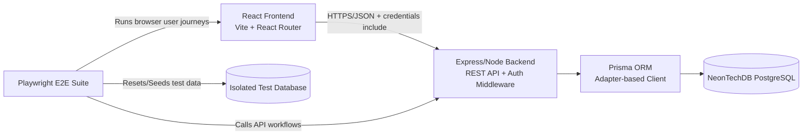
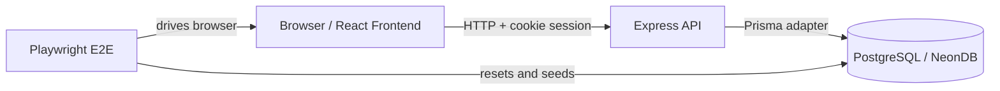

# Architecture Reference — Arrowhead Gym Management System

## 1. System Overview

The Arrowhead Gym Management System is structured as a monorepo with three primary packages: a **React frontend**, an **Express/TypeScript backend**, and a **Playwright E2E test suite**. Each package is independently installable but shares a root-level `package.json` for workspace-wide script orchestration.

---

## 2. High-Level Architecture Diagram

The diagram below illustrates the runtime communication paths between major system components.



---

## 3. Detailed Architecture Diagram



The frontend communicates with the backend exclusively over HTTP with `credentials: include`, ensuring the browser session cookie is transmitted on every request. The backend validates this session on each protected route before delegating to a controller.

---

## 4. Tech Stack Rationale

### 4.1 React + Vite

React was selected for its component model and ecosystem maturity. Vite provides fast hot-module replacement during local development and produces optimized production bundles. React Router handles client-side navigation and protected route shells.

### 4.2 Tailwind CSS v4

Tailwind provides a utility-first design system that allows rapid, consistent UI composition without maintaining a custom CSS layer. The `@tailwindcss/forms` plugin normalizes default browser form styling.

### 4.3 ExpressTS (Express + TypeScript)

Express provides a minimal, well-understood HTTP server framework with a rich middleware ecosystem. TypeScript in strict mode provides compile-time type guarantees on request/response shapes, middleware contracts, and controller return values, reducing runtime errors.

### 4.4 Prisma ORM

Prisma was selected for its type-safe database client, declarative schema language, and migration tooling. The generated client provides autocomplete-level type safety aligned with the `schema.prisma` model definitions. The adapter-based client pattern (via `prisma.config.ts`) allows the same Prisma instance to be shared across the Express process and seed scripts.

### 4.5 NeonDB (Serverless PostgreSQL)

NeonDB provides a managed PostgreSQL-compatible database with a serverless consumption model. Key properties that influenced this choice:

- **Pooled connection string (`DATABASE_URL`)**: Used by the running Express server to handle concurrent requests efficiently via the Neon connection pooler.
- **Direct connection string (`DIRECT_URL`)**: Used exclusively by Prisma CLI for migrations, which require a persistent, non-pooled connection.
- **6-hour PITR**: NeonDB's Point-in-Time Recovery window of 6 hours provides an operational safety net for accidental data mutations in production.

### 4.6 GitHub Actions (CI/CD)

Three automated workflows execute on push/PR to protected branches:

1. **Unit Tests** — Run Jest unit tests against an in-memory Prisma mock; no external database required.
2. **API Tests (Integration)** — Spin up a PostgreSQL service container, apply migrations, and run the integration test suite.
3. **E2E Tests** — Spin up PostgreSQL, build the frontend, start both servers, and run the full Playwright suite.
4. **Cloud Migration Check** — Apply Prisma migrations to the NeonDB test environment using the `DIRECT_DATABASE_URL_TEST` secret.

See [Testing Strategy](../guides/testing.md) for full CI/CD details.

---

## 5. Module Responsibilities

### 5.1 Backend (`backend/`)

| Module / Directory | Responsibility |
|---|---|
| `src/app.ts` | Composes the Express app: middleware order, CORS policy, cookie parsing, JSON parsing, and route mounting. |
| `src/server.ts` | Bootstraps the HTTP server process, selects runtime port, and starts listening. |
| `src/controllers/` | Implements request-level business logic and response shaping for each API domain. |
| `src/routes/` | Declares endpoint paths, HTTP methods, and middleware/controller wiring. |
| `src/middleware/` | Cross-cutting request guards: authentication verification and role-based authorization. |
| `src/utils/` | Shared backend utilities: JWT signing/verification, cookie options, password hashing. |
| `src/lib/` | Infrastructure clients and singletons, especially the Prisma client lifecycle. |
| `src/config/` | Environment parsing, normalization, and runtime-safe configuration via `ConfigManager` singleton. |
| `src/types/` | Backend TypeScript type contracts and Express request augmentations. |
| `src/patterns/` | GoF design pattern implementations: Singleton, Factory Method, Strategy, Observer, Command. |
| `backend/prisma/` | Data model schema, migration history, and seed scripts. |
| `backend/tests/` | Unit and integration test suites plus database reset helpers. |

#### 5.1.1 Reports and Analytics Pipeline

The reporting module uses a layered analytics pipeline to keep business logic explicit and reusable:

- **Controller normalization layer (`src/controllers/report.controller.ts`):** Query parameters such as `days`, `threshold`, and `mode` are normalized and clamped before any database operation is executed.
- **Analytics service layer (`src/services/analytics.service.ts`):** Business metrics are computed here, including retention risk scoring windows, monthly revenue forecasting inputs, and peak-utilization aggregation.
- **Factory Method output layer (`src/patterns/factory-method/report-creator.ts`):** Report payloads are transformed into stable DTO contracts through `ReportType`-driven factories with runtime guards.
- **Strategy layer (`src/services/revenueForecast.strategy.ts`):** Forecast mode (`CONSERVATIVE` or `OPTIMISTIC`) is applied as a pluggable strategy to baseline and churn-adjusted revenue inputs.

This separation allows each concern (input safety, metric computation, output contract, and forecast policy) to evolve independently while preserving consistent API behavior.

### 5.2 Frontend (`frontend/`)

| Module / Directory | Responsibility |
|---|---|
| `src/App.tsx` | Top-level route map and auth gate orchestration for dashboard navigation. |
| `src/pages/` | Route-level page containers that coordinate data loading and compose domain components. |
| `src/components/layout/` | Application chrome: sidebar, header, main shell, and inactivity timeout wrapper. |
| `src/components/common/` | Reusable UI primitives: search, filters, modal actions, timeout wrappers. |
| `src/components/<domain>/` | Domain-specific UI components for members, payments, suppliers, reports, equipment, and plans. |
| `src/services/` | API service layer keeping HTTP concerns isolated from UI components. |
| `src/types/` | Frontend domain interfaces shared by pages, components, and services. |
| `src/stories/` | Storybook stories and UI fixtures for isolated component/page rendering. |

### 5.3 E2E (`e2e/`)

| Module / Directory | Responsibility |
|---|---|
| `test/specs/` | End-to-end test scenarios validating critical user journeys in a real browser. |
| `test/support/` | Auth helpers, fixtures, and database reset/seed orchestration. |

---

## 6. Request Lifecycle

A typical authenticated API request follows this path:

```
Browser
  → HTTP Request (cookie: arrowhead_session)
  → Express Router (route match)
  → auth.middleware.ts (cookie verified → req.user populated)
  → Role Guard (ADMIN/STAFF check if required)
  → Controller (business logic)
  → Prisma Client (database query)
  → Response (JSON)
```

---

## 7. Related Documents

- [Database Schema](./02-database.md)
- [API Reference](./03-api-reference.md)
- [Testing Strategy](../guides/testing.md)
- [Developer Onboarding](../guides/onboarding.md)
