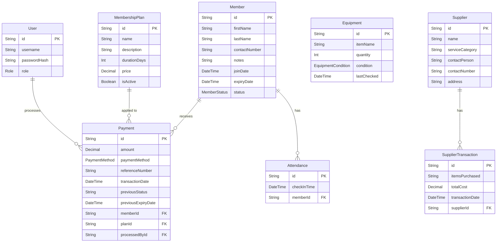

# Database Schema Reference — Arrowhead Gym Management System

## 1. Overview

The Arrowhead Gym Management System uses a **PostgreSQL** database managed through **Prisma ORM**. The schema is defined in `backend/prisma/schema.prisma` and versioned via Prisma Migrate. The production database is hosted on **NeonDB** (serverless PostgreSQL).

All table names use `snake_case` via Prisma's `@@map()` directive. All primary keys are **CUID** strings (collision-resistant unique identifiers). All models include `createdAt` and `updatedAt` timestamps.

---

## 2. Entity Relationship Overview

---

## 3. Model Definitions

### 3.1 `User` — Staff and Admin Accounts

**Table:** `users`

| Field | Type | Constraints | Description |
|---|---|---|---|
| `id` | `String` | PK, CUID | System-generated unique identifier |
| `username` | `String` | Unique | Login identifier selected by admin |
| `passwordHash` | `String` | — | bcrypt hash of the user's password |
| `role` | `Role` | Enum | `ADMIN` or `STAFF` |
| `createdAt` | `DateTime` | Default: `now()` | Record creation timestamp |
| `updatedAt` | `DateTime` | Auto-updated | Record modification timestamp |

**Relations:**
- `processedPayments`: One-to-many with `Payment` (all payments this user processed)

---

### 3.2 `Member` — Gym Member Registry

**Table:** `members`

| Field | Type | Constraints | Description |
|---|---|---|---|
| `id` | `String` | PK, CUID | System-generated unique identifier |
| `firstName` | `String` | — | Member's given name |
| `lastName` | `String` | — | Member's family name |
| `contactNumber` | `String` | Unique | Primary contact number; uniqueness enforced for deduplication |
| `notes` | `String` | Default: `""` | Freeform staff notes on the member |
| `joinDate` | `DateTime` | Default: `now()` | Date the member originally enrolled |
| `expiryDate` | `DateTime?` | Nullable | Current membership expiry; updated on payment |
| `status` | `MemberStatus` | Default: `ACTIVE` | `ACTIVE`, `INACTIVE`, or `EXPIRED` |
| `createdAt` | `DateTime` | Default: `now()` | Record creation timestamp |
| `updatedAt` | `DateTime` | Auto-updated | Record modification timestamp |

**Relations:**
- `attendances`: One-to-many with `Attendance`
- `payments`: One-to-many with `Payment`

---

### 3.3 `MembershipPlan` — Plan Catalogue

**Table:** `membership_plans`

| Field | Type | Constraints | Description |
|---|---|---|---|
| `id` | `String` | PK, CUID | System-generated unique identifier |
| `name` | `String` | — | Display name of the plan (e.g., "Monthly") |
| `description` | `String?` | Nullable | Optional additional description |
| `durationDays` | `Int` | — | Number of days the plan extends membership |
| `price` | `Decimal` | `Decimal(10,2)` | Plan cost in local currency |
| `isActive` | `Boolean` | Default: `true` | Controls visibility via `GET /api/plans` |
| `createdAt` | `DateTime` | Default: `now()` | Record creation timestamp |
| `updatedAt` | `DateTime` | Auto-updated | Record modification timestamp |

---

### 3.4 `Payment` — Membership Payment Transactions

**Table:** `payments`

| Field | Type | Constraints | Description |
|---|---|---|---|
| `id` | `String` | PK, CUID | System-generated unique identifier |
| `amount` | `Decimal` | `Decimal(10,2)` | Amount collected for this payment |
| `paymentMethod` | `PaymentMethod` | Enum | `CASH` or `GCASH` |
| `referenceNumber` | `String?` | Nullable | GCash or other reference; optional for cash |
| `transactionDate` | `DateTime` | Default: `now()` | Timestamp of the recorded transaction |
| `previousStatus` | `String?` | Nullable | Member status before this payment (for undo) |
| `previousExpiryDate` | `DateTime?` | Nullable | Member expiry before this payment (for undo) |
| `memberId` | `String` | FK → `Member.id` | The member receiving this payment |
| `planId` | `String` | FK → `MembershipPlan.id` | The plan applied |
| `processedById` | `String` | FK → `User.id` | The staff/admin who recorded the payment |
| `createdAt` | `DateTime` | Default: `now()` | Record creation timestamp |
| `updatedAt` | `DateTime` | Auto-updated | Record modification timestamp |

**Indexes:** `memberId`, `planId`, `processedById`

> **Note:** `previousStatus` and `previousExpiryDate` support the payment undo feature (available within a configurable grace period). These fields are populated at payment creation by the Command pattern implementation in `src/patterns/command/`.

---

### 3.5 `Attendance` — Daily Check-In Records

**Table:** `attendances`

| Field | Type | Constraints | Description |
|---|---|---|---|
| `id` | `String` | PK, CUID | System-generated unique identifier |
| `checkInTime` | `DateTime` | Default: `now()` | Timestamp of the check-in event |
| `memberId` | `String` | FK → `Member.id` | The member who checked in |
| `createdAt` | `DateTime` | Default: `now()` | Record creation timestamp |
| `updatedAt` | `DateTime` | Auto-updated | Record modification timestamp |

**Indexes:** `memberId`, `checkInTime`

---

### 3.6 `Equipment` — Gym Equipment Inventory

**Table:** `equipment`

| Field | Type | Constraints | Description |
|---|---|---|---|
| `id` | `String` | PK, CUID | System-generated unique identifier |
| `itemName` | `String` | — | Name or description of the equipment item |
| `quantity` | `Int` | — | Current stock quantity |
| `condition` | `EquipmentCondition` | Default: `GOOD` | `GOOD`, `MAINTENANCE`, or `BROKEN` |
| `lastChecked` | `DateTime?` | Nullable | Timestamp of the most recent condition inspection |
| `createdAt` | `DateTime` | Default: `now()` | Record creation timestamp |
| `updatedAt` | `DateTime` | Auto-updated | Record modification timestamp |

---

### 3.7 `Supplier` — Supplier Directory

**Table:** `suppliers`

| Field | Type | Constraints | Description |
|---|---|---|---|
| `id` | `String` | PK, CUID | System-generated unique identifier |
| `name` | `String` | — | Supplier business name |
| `serviceCategory` | `String` | Default: `"GENERAL"` | Category of goods/services provided |
| `contactPerson` | `String?` | Nullable | Name of primary contact at the supplier |
| `contactNumber` | `String?` | Nullable | Contact phone or mobile number |
| `address` | `String?` | Nullable | Supplier physical address |
| `createdAt` | `DateTime` | Default: `now()` | Record creation timestamp |
| `updatedAt` | `DateTime` | Auto-updated | Record modification timestamp |

**Relations:**
- `transactions`: One-to-many with `SupplierTransaction`

---

### 3.8 `SupplierTransaction` — Procurement Records

**Table:** `supplier_transactions`

| Field | Type | Constraints | Description |
|---|---|---|---|
| `id` | `String` | PK, CUID | System-generated unique identifier |
| `itemsPurchased` | `String` | — | Description of items bought |
| `totalCost` | `Decimal` | `Decimal(10,2)` | Total cost of the transaction |
| `transactionDate` | `DateTime` | Default: `now()` | Date the transaction occurred |
| `supplierId` | `String` | FK → `Supplier.id` | The supplier involved |
| `createdAt` | `DateTime` | Default: `now()` | Record creation timestamp |
| `updatedAt` | `DateTime` | Auto-updated | Record modification timestamp |

**Indexes:** `supplierId`

---

## 4. Enumerations

| Enum | Values | Used By |
|---|---|---|
| `Role` | `ADMIN`, `STAFF` | `User.role` |
| `MemberStatus` | `ACTIVE`, `INACTIVE`, `EXPIRED` | `Member.status` |
| `PaymentMethod` | `CASH`, `GCASH` | `Payment.paymentMethod` |
| `EquipmentCondition` | `GOOD`, `MAINTENANCE`, `BROKEN` | `Equipment.condition` |

---

## 5. NeonDB Backup and Recovery Strategy

### 5.1 Point-in-Time Recovery (PITR)

NeonDB provides a **6-hour Point-in-Time Recovery** window on all database branches under the free tier. This means that any accidental data modification or deletion can be recovered to a prior state within a 6-hour window by branching from a previous point in time.

**Recovery procedure (NeonDB console):**
1. Navigate to the NeonDB project console.
2. Select **Branches** → **Create branch**.
3. Set the restore point to the desired timestamp (within the past 6 hours).
4. Update the application `DATABASE_URL` to point to the recovery branch temporarily.
5. Export data from the recovery branch to the production branch as required.

### 5.2 Isolated Test Database

A separate NeonDB branch (or a local PostgreSQL instance) is used for all integration and E2E testing. This isolation prevents test resets from touching production data. The `DATABASE_URL_TEST` environment variable controls which database test suites target.

### 5.3 Migration Strategy

Database schema changes are applied via **Prisma Migrate**:

- `npx prisma migrate dev` — Local development migrations (auto-creates migration files).
- `npx prisma migrate deploy` — Production migration deployment (no prompts; used in CI).
- The CI `cloud-migration-check` job runs `migrate deploy` against the NeonDB test branch using the `DIRECT_DATABASE_URL_TEST` secret to validate migrations before they reach production.

---

## 6. Related Documents

- [Architecture Reference](./01-architecture.md)
- [API Reference](./03-api-reference.md)
- [Requirements Elicitation](../business/01-requirements.md)
